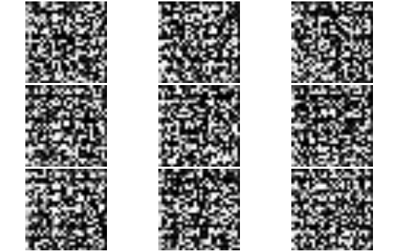
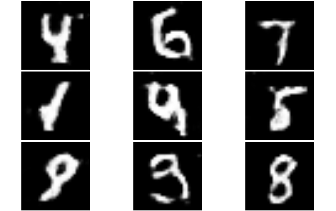

```{r setup, include=FALSE}
#options(htmltools.dir.version = FALSE)
require("dplyr")
require("DT")
require("plotly")
require("scales")
require("mxnet")
```


##Architecture symbolique

La composition symbolique du modèle permet de définir:  
  - Ses entrants et les variables réponse  
  - Sa structure  
  - Sa fonction objective (RMSE, MAE, Softmax, ...)  

```{r, echo=T, include=FALSE}
data<- mx.symbol.Variable(name = "data")
label<- mx.symbol.Variable(name = "label")
label<- mx.symbol.identity(label, name = "label")
weight1<- mx.symbol.Variable(name = "weight1")
weight1<- mx.symbol.identity(weight1, name = "weight1")
bias1<- mx.symbol.Variable(name = "bias1")
bias1<- mx.symbol.identity(bias1, name = "bias1")
final<- mx.symbol.FullyConnected(data=data, num_hidden=1, weight=weight1, bias=bias1, name = "final")
perte<- mx.symbol.LinearRegressionOutput(data=final, label=label, name = "perte_lineaire")
```

```{r, echo=FALSE, fig.align='center'}
graph.viz(perte, shape = c(10,64), type = "graph", direction = "LR", graph.width.px = 500, graph.height.px = 240)
```

```{r, echo=T}
data<- mx.symbol.Variable(name = "data")
final<- mx.symbol.FullyConnected(data=data, num_hidden=1, name = "final")
perte<- mx.symbol.LinearRegressionOutput(data=final, name = "perte_lineaire")
```


##De la régression simple au deep learning

Aucun calcul n'est réalisé à cette étape. 
Seule la structure du modèle est définie afin de déterminer les dépendances de calculs aux fins d'optimisation de l'exécution et la gestion de la mémoire. 

```{r, include=F}
data<- mx.symbol.Variable(name = "data")
weight1<- mx.symbol.Variable(name = "weight1")
weight1<- mx.symbol.identity(weight1, name = "weight1")

fc1<- mx.symbol.FullyConnected(data=data, num_hidden=4, weight=weight1, name = "fc_1")
act1<- mx.symbol.Activation(data=fc1, act_type="relu", name = "act_1")

weight2<- mx.symbol.Variable(name = "weight2")
weight2<- mx.symbol.identity(weight2, name = "weight2")

final<- mx.symbol.FullyConnected(data=act1, num_hidden=1, weight=weight2, name = "final")
perte<- mx.symbol.LinearRegressionOutput(data=final, name = "perte_lineaire")
```

```{r, echo=FALSE, fig.align='left'}
graph.viz(perte, shape = c(10,64), type = "graph", direction = "LR", graph.width.px = 800, graph.height.px = 240)
```

```{r, echo=T}
data<- mx.symbol.Variable(name = "data")
fc1<- mx.symbol.FullyConnected(data=data, num_hidden=4, name = "fc_1")
act1<- mx.symbol.Activation(data=fc1, act_type="relu", name = "act_1")
final<- mx.symbol.FullyConnected(data=act1, num_hidden=1, name = "final")
perte<- mx.symbol.LinearRegressionOutput(data=final, name = "perte_lineaire")
```


##Du symbole au calcul

Une fois la structure du modèle définie, il reste à mettre en place les composantes qui permettront à l'algorithme de s'exécuter sur les données réelles.

- Initialisation: spécifie la manière dont sont assignés les paramètres avant l'exécution de l'optimisation.  
    - Normal  
    - Uniforme  
    - Xavier
    
- Itérateur de données: module dont l'exécution renvoie les données entrantes les variables réponse. 

- Optimiseur: module qui définit la façon dont les paramètres sont mis à jour à chaque itération. 

- Exécuteur: instance qui exécute les calculs. Il peut y en avoir un seul (CPU) ou plusieurs (multi-GPU).


##Itérateur

La tâche de l'itérateur est de fournir aux exécuteurs les données nécessaires aux calculs pour chacune des itérations sur les mini-batch. 

Les itérateurs pré-définis sont: 

  - mx.io.arrayiter: itérateur prenant un objet array comme entrée  
  - mx.io.CSVIter: lecture d'un CSV  
  - mx.io.ImageRecordIter: lecture d'images en format binaire 
  
Des itérateurs personnalisés peuvent être construits directement en R, leur performance dépend des fonctionnalités sous-jacentes. 

À noter que l'utilisation d'itérateurs sur des CSV ou images permet d'éviter la contrainte de charger la totalité des données en mémoire.  


##Optimiseur


Crédit: [Sebastian Ruder](http://sebastianruder.com/optimizing-gradient-descent/)


##Exécuteur


Crédit: [mxnet.io](http://mxnet.io/architecture/note_engine.html)


##Exemple - Régression linéaire personnalisée

```{r, echo=F}

data(BostonHousing, package="mlbench")

set.seed(123)
train.ind = sample(1:nrow(BostonHousing), size = round(0.5*nrow(BostonHousing),0), replace = F)
train_x = data.matrix(BostonHousing[train.ind, -14])
train_y = BostonHousing[train.ind, 14]
test_x = data.matrix(BostonHousing[-train.ind, -14])
test_y = BostonHousing[-train.ind, 14]

```

```{r, echo=T}
data <- mx.symbol.Variable("data")
label <- mx.symbol.Variable("label")
label <- mx.symbol.identity(label, name="label")
fc1 <- mx.symbol.FullyConnected(data=data, num_hidden=1, name="fc1")
fc1 <- mx.symbol.Reshape(data=fc1, shape=c(0), name="fc1_reshape")
perc_err <- mx.symbol.abs(fc1/label-1, name="perc_error")
custom_loss <- mx.symbol.MakeLoss(perc_err, name="loss")
graph.viz(custom_loss, direction="LR", graph.height.px = 160)
```

```{r, echo=T}

model_reg<- mx.model.FeedForward.create(symbol = custom_loss, 
                                        X = train_x, y = train_y, 
                                        eval.data = list(data=test_x, label=test_y),
                                        ctx = mx.cpu(), num.round = 24, 
                                        array.batch.size = 32,
                                        optimizer = "sgd",
                                        learning.rate=0.000001,
                                        momentum=0.9,
                                        wd=0.0001, epoch.end.callback = mx.callback.log.train.metric(1), eval.metric = mx.metric.rmse
)

```


##Réutilisation de modèles pré-entraînés

Un modèle peut être représenté comme la combinaison de 2 composantes:  

  - Structure symbolique: graph représentant l'enchaînement des différents opérateurs  
  - Paramètres: les poids associés aux opérateurs

Un modèle performant  bien à une tâche peut fournir une bonne base pour des tâches connexes. 

Exemple: Chat vs Chien avec Resnet [Microsoft 2015](https://arxiv.org/abs/1512.03385)

  1. Charger le modèles de référence (Resnet)  
  2. Adapter la structure au nouveau problème (changer le nombre de neuronnes de la dernière couche de 1000 à 2)  
  3. Réutiliser les poids du modèle de référence pour tous les opérateurs saufs ceux qui ont été adaptés. 
  4. Initialiser aléatoirement les paramètres qui ne sont pas transférés du modèle de référence. 
  5. Run!  

Une collection de modèles pré-entraînées est disponible dans le [zoo](http://mxnet.io/model_zoo/index.html)


##Analyse de langage avec CNN

[text CNN](http://www.wildml.com/2015/11/understanding-convolutional-neural-networks-for-nlp/)

[sentence classification](https://arxiv.org/pdf/1408.5882.pdf)


##Analyse de langage avec RNN


Crédit: [Andrej Karpathy](http://karpathy.github.io/2015/05/21/rnn-effectiveness/)

##Bucketing


##Modèle adversial


Crédit: [Tryolabs](https://tryolabs.com/blog/2016/12/06/major-advancements-deep-learning-2016/)


## Modèle adversial - Définition symbolique

Les modèle adversial recoupe une famille de modèles dont le trait commun est de mettre en compétition 2 sous-modèles: 

  - Générateur: à partir de bruit, génère une réponse (image, texte, vecteur...)  
  - Discriminateur: identifie si la valeur d'entrée provient d'un échantillon réel ou a plutôt été produit par le générateur


## GAN Conditionel sur MNIST


Crédit: [Rowel Atienza](https://medium.com/towards-data-science/gan-by-example-using-keras-on-tensorflow-backend-1a6d515a60d0)

--- 



--- 


--- 




--- 


Crédit: [Vincent Dumoulin](https://github.com/vdumoulin/conv_arithmetic)


