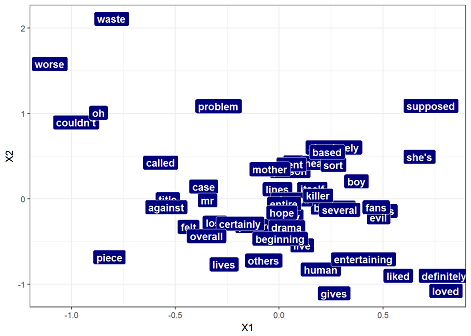
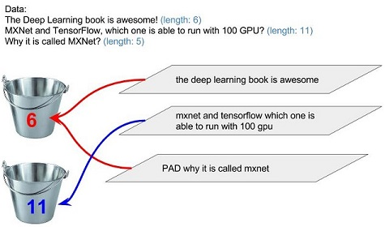
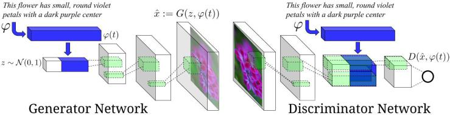

```{r setup, include=FALSE}
require("dplyr")
require("DT")
require("plotly")
require("scales")
require("mxnet")
source("Resnet_factory.R")
```


```{r, echo=FALSE}

data(BostonHousing, package="mlbench")

set.seed(123)
train.ind = sample(1:nrow(BostonHousing), size = round(0.5*nrow(BostonHousing),0), replace = F)
train_x = data.matrix(BostonHousing[train.ind, -14])
train_y = BostonHousing[train.ind, 14]
eval_x = data.matrix(BostonHousing[-train.ind, -14])
eval_y = BostonHousing[-train.ind, 14]

```


## Aperçu de la librairie

MXNet est un engin permettant le développement, l'entraînement et le déploiement de modèle de Deep Learning. 

Son architecture facilite l'exécution en parallèle sur de multiples GPU ou machines (Yarn - Hadoop)

Plusieurs langages sont supportés: R, Python, Scala, Julia, Perl, C++ en plus de permettre le déploiement de modèle sur mobile pour l'inférence.  

Le projet a été reçu en 2017 dans l'Incubateur Apache et a été choisi comme engin de prédilection chez Amazon. 

Le nom MXNet provient d'utilisation mixte de composantes de code impératif et déclaratif. 

## Composantes d'un modèle

- Architecture: représentation symbolique des opérateurs qui composent le modèle et définissent les transformations applicables aux entrants.   

- Itérateur de données: fonction dont l'exécution fournit au modèle les entrants requis pour son exécution (ex: variables explicatives et réponses). 

- Optimiseur: module qui définit la façon dont les paramètres sont mis à jour à chaque itération. 

- Initialisation: spécifie la manière dont sont assignés les paramètres avant l'exécution de l'optimisation.

- Exécuteur: instance qui exécute les calculs. Il peut y en avoir un seul (CPU) ou plusieurs (multi-GPU).  

## Architecture

La composition symbolique du modèle permet de définir:  les entrants et les variables réponse, la structure et la fonction objective (RMSE, MAE, Softmax, ...). 

Aucun calcul n'est effectué à cette étape. Seule la structure du modèle est établie afin de déterminer les dépendances de calculs aux fins d'optimisation de l'exécution et la gestion de la mémoire. 

```{r, echo=TRUE, include=FALSE}
data<- mx.symbol.Variable(name = "data")
label<- mx.symbol.Variable(name = "label")
label<- mx.symbol.identity(label, name = "label")
weight1<- mx.symbol.Variable(name = "weight1")
weight1<- mx.symbol.identity(weight1, name = "weight1")
bias1<- mx.symbol.Variable(name = "bias1")
bias1<- mx.symbol.identity(bias1, name = "bias1")
final<- mx.symbol.FullyConnected(data=data, num_hidden=1, weight=weight1, bias=bias1, name = "final")
perte<- mx.symbol.LinearRegressionOutput(data=final, label=label, name = "perte_lineaire")
```

```{r, echo=FALSE, fig.align='center'}
graph.viz(perte, shape = c(10,64), type = "graph", direction = "LR", graph.width.px = 450, graph.height.px = 240)
```

```{r, echo=TRUE, eval=TRUE}
data<- mx.symbol.Variable(name = "data")
final<- mx.symbol.FullyConnected(data=data, num_hidden=1, name = "final")
perte<- mx.symbol.LinearRegressionOutput(data=final, name = "perte_lineaire")
```


## Exemples d'architectures

#### Multi-layer perceptron

Régression/classification

```{r, include=FALSE}
data<- mx.symbol.Variable(name = "data")
weight1<- mx.symbol.Variable(name = "weight1")
#weight1<- mx.symbol.identity(weight1, name = "weight1")

fc1<- mx.symbol.FullyConnected(data=data, num_hidden=5, weight=weight1, name = "fc_1")
act1<- mx.symbol.Activation(data=fc1, act_type="relu", name = "act_1")

weight2<- mx.symbol.Variable(name = "weight2")
#weight2<- mx.symbol.identity(weight2, name = "weight2")

final<- mx.symbol.FullyConnected(data=act1, num_hidden=1, weight=weight2, name = "final")
perte<- mx.symbol.LinearRegressionOutput(data=final, name = "perte_lineaire")
```


```{r, echo=FALSE}
graph.viz(perte, shape = c(10,64), type = "graph", direction = "LR", graph.width.px = 600, graph.height.px = 80)
```

```{r, echo=TRUE, eval=TRUE}
data<- mx.symbol.Variable(name = "data")
fc1<- mx.symbol.FullyConnected(data=data, num_hidden=5, name = "fc_1")
act1<- mx.symbol.Activation(data=fc1, act_type="relu", name = "act_1")
final<- mx.symbol.FullyConnected(data=act1, num_hidden=1, name = "final")
perte<- mx.symbol.LinearRegressionOutput(data=final, name = "perte_lineaire")
```


#### Convolutionnal Neural Network

Reconnaissance d'image - Microsoft ResNet

```{r, echo=FALSE}
resnet<- Resnet_factory(num_classes = 2, loops = 1)
graph.viz(resnet, type = "graph", direction = "LR", graph.width.px = 975, graph.height.px = 100)
```

```{r, echo=TRUE, eval=TRUE}
resnet<- Resnet_factory(num_classes = 2, loops=1)
```


## Itérateur

La tâche de l'itérateur est de fournir aux exécuteurs les données nécessaires aux calculs pour chacune des itérations sur les mini-batch. 

Les itérateurs pré-définis sont: 

- mx.io.arrayiter: itérateur prenant un objet array comme entrée  
- mx.io.CSVIter: lecture d'un CSV  
- mx.io.ImageRecordIter: lecture d'images en format binaire 

Des itérateurs personnalisés peuvent être construits directement en R, leur performance dépend des fonctionnalités sous-jacentes. 

À noter que l'utilisation d'itérateurs sur des CSV ou images permet d'éviter la contrainte de charger la totalité des données en mémoire.  

MXNet fonctionne par défaut avec des données orientées par colonnes (chaque observation se trouve dans une colonne différente). 

```{r}
train_iter<- mx.io.arrayiter(data = t(train_x), label = train_y, batch.size = 64, shuffle = TRUE)
eval_iter<- mx.io.arrayiter(data = t(eval_x), label = eval_y, batch.size = 64, shuffle = FALSE)
```


## Optimiseur

La technique de base pour la mise à jour des paramètres repose sur le Stochastic Gradient Descent (SGD). De nombreuses variantes développées pour rendre plus rapide ou robuste la convergence sont disponibles et des variantes personnalisées peuvent être implantées simplement.    


Crédit: [Alec Radford](http://www.denizyuret.com/2015/03/alec-radfords-animations-for.html)

```{r}
optimizer_sgd<- mx.opt.create(name = "sgd", learning.rate=0.01, momentum=0.2, wd=0.001, clip_gradient = NULL)
optimizer_adadelta<- mx.opt.create(name = "adadelta", rho=0.9, epsilon=1e-5, wd=0.001, clip_gradient = NULL)
```


## Initialisation

Afin que le modèle puisse apprendre, des valeurs aléatoires sont assignées aux paramètres du modèle avant l'exécution de l'optimisation. Différentes approches sont disponibles: Normal, Uniforme, Xavier. 

```{r}
initializer_uniform = mx.init.uniform(0.01)
initializer_normal = mx.init.normal(0.01)
initializer_Xavier = mx.init.Xavier(rnd_type = "gaussian", factor_type = "avg", magnitude = 2)
```

```{r}
shapes<- perte$infer.shape(list(data=c(10,64)))
init_weight<- mx.init.create(initializer_Xavier, shape.array = shapes$arg.shapes, ctx = mx.cpu())
```

Paramètres initiaux de la première couche: 

```{r, echo=FALSE}
as.array(init_weight$fc_1_weight)
```


## Exécuteur

```{r}
devices<- list(mx.gpu(0), mx.gpu(1))
```


Crédit: [mxnet.io](http://mxnet.io/architecture/note_engine.html)


## Exemple - Régression avec MLP

```{r, echo=FALSE}
devices<- list(mx.cpu())
```


```{r, echo=TRUE}
model_reg<- mx.model.FeedForward.create(symbol = perte, 
                                        num.round = 5, 
                                        X = train_iter,
                                        eval.data = eval_iter,
                                        ctx = devices,
                                        optimizer = optimizer_adadelta,
                                        eval.metric = mx.metric.rmse, 
                                        initializer = initializer_uniform,
                                        epoch.end.callback = mx.callback.log.train.metric(1),
                                        verbose = TRUE)
```
```{r, include=FALSE}
mx.model.save(model = model_reg, prefix = "model_reg", iteration = 5)
```


##Réutilisation de modèles pré-entraînés

Un modèle peut être représenté comme la combinaison de 2 composantes:  

  - Structure symbolique: graph représentant l'enchaînement des différents opérateurs  
  - Paramètres: les poids associés aux opérateurs

Un modèle performant  bien à une tâche peut fournir une bonne base pour des tâches connexes. 

Exemple: Chat vs Chien avec Resnet [Microsoft 2015](https://arxiv.org/abs/1512.03385)

  1. Charger le modèles de référence (Resnet)  
  2. Adapter la structure au nouveau problème (changer le nombre de neuronnes de la dernière couche de 1000 à 2)  
  3. Réutiliser les poids du modèle de référence pour tous les opérateurs saufs ceux qui ont été adaptés. 
  4. Initialiser aléatoirement les paramètres qui ne sont pas transférés du modèle de référence. 
  5. Run!  

Une collection de modèles pré-entraînées est disponible dans le [zoo](http://mxnet.io/model_zoo/index.html)


## Analyse de langage avec CNN


Crédit: [Zang et Wallace](https://arxiv.org/pdf/1510.03820.pdf) et [WildML](http://www.wildml.com/2015/11/understanding-convolutional-neural-networks-for-nlp/)


## Analyse de langage avec CNN

Un opérateur clé dans l'analyse de texte ou toute autre donnée à haute dimensionnalité est le embedding. Cet opérateur permet la vectorisation de l'information. 

Pour une analyse des critiques de films sur IMDB, les mots ont été vectorisés en 2 dimensions: 

```{r, echo=TRUE, eval=FALSE}
embed <- mx.symbol.Embedding(data=data, input_dim=vocab_size, output_dim=2, name="embed")
```



## Analyse de langage avec RNN

Les modès récurrents (RNN) forment une famille de modèles ayant mené à des avancées pas moins significatives que ce qu'ont permis les CNN, notamment pour la traduction machine (Google Translate). 


Crédit: [Andrej Karpathy](http://karpathy.github.io/2015/05/21/rnn-effectiveness/)

## Analyse de langage avec RNN

L'analyse de sequences apporte des complications par rapport aux modèles conventionnels. Le nombre de mots (oude caractères) par exemple d'une phrase varie d'une observation à l'autre alors que la définition traditionelle d'un modèle symbolique implique une longueur fixeà la séquence. 

Deux trucs viennent à la rescousse:  
  - Padding  
  - Bucketing



## Generative Adversial Network (GAN)

Les modèle adversial recoupe une famille de modèles dont le trait commun est de mettre en compétition 2 sous-modèles: 

  - Générateur: à partir de bruit, génère une réponse (image, texte, vecteur...)  
  - Discriminateur: identifie si la valeur d'entrée provient d'un échantillon réel ou a plutôt été produit par le générateur

Le GAN conditionel est une variation permettant de générer un objet ayant des caractéristiques spécifiques. Ça peut être l'étiquette de la classe (ex: un chiffre pour MNIST) ou encore une expression plus élaborée (ex: un chat noir sur une chaise verte). 



Crédit: [Scott Reed](https://github.com/reedscot/icml2016)

## Generative Adversial Network (GAN)

L'implantation sur-mesure de nouvelles architectures nécessite d'aller au coeur des fonctionnalités de MXNet et permet de juger de la flexibilité de la plateforme pour le développement de nouveau modèles.

Exemple de code pour l'entraînement du générateur: 

```{r, eval=FALSE}
exec_D_back<- mxnet:::mx.symbol.bind(symbol = D_sym, ctx = devices,
                                     arg.arrays = exec_D$arg.arrays, 
                                     aux.arrays = exec_D$aux.arrays, 
                                     grad.reqs = rep("write", length(exec_D$arg.arrays)))

mx.exec.update.arg.arrays(exec_D_back, 
                          arg.arrays = list(data=D_data_fake, 
                                            digit=D_digit_fake, 
                                            label=mx.nd.array(rep(1, batch_size))), match.name=TRUE)

mx.exec.forward(exec_D_back, is.train=TRUE)
mx.exec.backward(exec_D_back)

D_grads<- exec_D_back$ref.grad.arrays$data
mx.exec.backward(exec_G, out_grads=D_grads)

update_args_G<- updater_G(weight = exec_G$ref.arg.arrays, grad = exec_G$ref.grad.arrays)
mx.exec.update.arg.arrays(exec_G, update_args_G, skip.null=TRUE)
```

